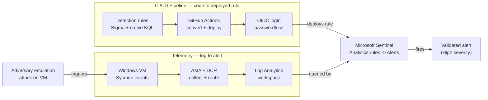
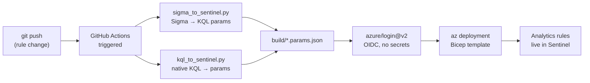

# Detection-as-Code on Microsoft Sentinel

> An end-to-end detection engineering lab: a Windows attack range feeding Microsoft Sentinel,
> with detection rules authored as **Sigma** (auto-converted to KQL) and **native KQL**, deployed
> automatically through a **GitHub Actions CI/CD pipeline using OIDC (passwordless) authentication**,
> and validated through **adversary emulation** mapped to MITRE ATT&CK.

**Author:** Yusuf Efil — SOC Analyst / Detection Engineer
**Stack:** Microsoft Sentinel · Azure Monitor (AMA + DCR) · Sysmon · Sigma · pySigma · GitHub Actions · Bicep · KQL

---

## 🇹🇷 Kısa Türkçe Özet

Bu proje, sıfırdan kurulmuş uçtan uca bir **detection engineering** lab'idir. Bir Windows VM'in saldırı
izleri (Sysmon) Azure Monitor üzerinden Sentinel'e akar. Detection kuralları **Sigma** (otomatik KQL'e
çevrilir) ve **native KQL** olarak yazılır, **GitHub Actions** ile **parolasız (OIDC)** otomatik deploy
edilir, ve **gerçek saldırı emülasyonuyla** (Atomic-style) test edilip MITRE ATT&CK'e haritalanır.
Amaç: "kural tıklayan" değil, **kural fabrikası kuran** mühendisliği göstermek. Kapsanan teknikler:
encoded PowerShell (T1059.001), LSASS dump (T1003.001), ve Office→shell davranışsal (T1566/T1059).

---

## Why this project

Most detection work in a SOC is done by hand: writing a rule in the SIEM's console, testing it once,
moving on. This lab demonstrates the opposite — **detections as version-controlled code**, deployed
through a pipeline, and **proven** against real adversary behaviour rather than assumed to work.

Three things this is meant to show:
1. **Engineering, not clicking** — rules live in Git, convert automatically, deploy on `git push`.
2. **Behavioural detection** — beyond signature matching, including parent-child process analysis on Sysmon telemetry.
3. **Validation** — every rule is fired by an emulated attack and confirmed to produce an alert.

---

## Architecture

Two flows meet at Sentinel: a **pipeline** (code → deployed rule) and **telemetry** (log → alert).



**In one sentence:** push a rule → it auto-deploys to Sentinel; run an emulated attack on the VM →
telemetry flows up through AMA/DCR into the workspace → the rule fires a validated alert.

---

## MITRE ATT&CK Coverage

Every technique below is implemented as a deployed rule **and** validated by running the attack and
confirming the alert.

| Tactic | Technique | Detection rule | Source format | Data source | Status |
|---|---|---|---|---|---|
| Initial Access | **T1566** Phishing | Office Application Spawning a Shell | native KQL | Sysmon EID 1 (parsed) | ✅ Emulated → High alert |
| Execution | **T1059.001** PowerShell | Suspicious Encoded PowerShell | Sigma → KQL | SecurityEvent 4688 | ✅ Emulated → High alert |
| Credential Access | **T1003.001** LSASS Memory | LSASS Dump via Comsvcs/ProcDump | Sigma → KQL | SecurityEvent 4688 | ✅ Emulated → High alert |

```
Initial Access        Execution             Credential Access
┌──────────────┐      ┌──────────────┐      ┌──────────────────┐
│ T1566        │      │ T1059.001    │      │ T1003.001        │
│ Phishing     │      │ PowerShell   │      │ LSASS Memory     │
│ Office→shell │      │ Encoded cmd  │      │ comsvcs/procdump │
│ (native KQL) │      │ (Sigma→KQL)  │      │ (Sigma→KQL)      │
└──────┬───────┘      └──────┬───────┘      └────────┬─────────┘
       │                     │                       │
   Emulated →            Emulated →              Emulated →
   High alert            High alert              High alert
```

An ATT&CK Navigator layer is included at [`attack-navigator-layer.json`](./attack-navigator-layer.json).

---

## How the pipeline works



The pipeline handles **two rule sources** from a single push:
- **Sigma rules** (`rules/sigma/*.yml`) → converted to KQL via `pySigma` (kusto backend), then to
  Sentinel deployment params by `sigma_to_sentinel.py`.
- **Native KQL rules** (`rules/kql/*.yaml`) → parsed by `kql_to_sentinel.py` into the same params shape.

Both produce `build/*.params.json`, which a parameterized **Bicep** template deploys as Scheduled
Analytics Rules. Authentication to Azure uses **OIDC federated identity** — no secrets or passwords
are stored; GitHub Actions presents a short-lived, signed token that Azure validates against a
federated credential scoped to this repo's `main` branch.

---

## Repository structure

```
.
├── .github/workflows/deploy.yml      # CI/CD: convert + deploy on push (OIDC)
├── rules/
│   ├── sigma/                        # Sigma detections (vendor-neutral)
│   │   ├── win_susp_encoded_powershell.yml
│   │   └── win_lsass_dump.yml
│   └── kql/                          # native KQL detections
│       └── office_spawning_shell.yaml
├── tooling/
│   ├── sigma_to_sentinel.py          # Sigma → KQL → deployment params
│   └── kql_to_sentinel.py            # native KQL → deployment params
├── infra/
│   └── scheduled-rule.bicep          # parameterized Analytics Rule template
├── attack-navigator-layer.json       # ATT&CK coverage layer
└── README.md
```
*(This repo also contains earlier QRadar detection work — CRE rules, AQL queries, and a Sigma→Splunk
converter — under `qradar/`, `kql/`, and `tools/`, showing detection engineering across multiple SIEMs.)*

---

## A note on the Office→shell rule (behavioural detection)

The most advanced rule detects a **Microsoft Office application spawning a shell** (`winword.exe` →
`powershell.exe`, etc.) — the signature of macro-based phishing, one of the most common initial-access
vectors.

Because the ATT&CK Navigator's ASIM parser wasn't available in the lab tenant, the rule **parses raw
Sysmon EventID 1 XML directly in KQL** using `extract()` to normalize `ParentImage` and `Image`
fields, then matches the parent-child relationship:

```kql
Event
| where Source == "Microsoft-Windows-Sysmon" and EventID == 1
| extend Image       = extract(@'Name="Image">([^<]+)<', 1, EventData),
         ParentImage = extract(@'Name="ParentImage">([^<]+)<', 1, EventData)
| where ParentImage has_any ("winword.exe","excel.exe","powerpnt.exe","outlook.exe")
| where Image       has_any ("powershell.exe","cmd.exe","wscript.exe","mshta.exe")
```

This is the same normalization ASIM performs, done explicitly — demonstrating raw EDR-telemetry
parsing and behavioural (relationship-based, not signature-based) detection.

---

## Engineering problems solved (the real work)

A working pipeline is the easy part; the value is in the edge cases. Documented troubleshooting:

| Problem | Root cause | Fix |
|---|---|---|
| Telemetry never arrived (empty Heartbeat) | Managed identity assigned **after** the agent started → no auth token | `az vm restart` to re-initialize the agent |
| Sigma conversion failed in CI but worked locally | `subprocess(shell=True)` behaves differently on Linux runners | Removed `shell=True` for cross-platform compatibility |
| OIDC login failed (`AADSTS70021`) | Federated credential `subject` was malformed (empty variable → `repo:/heads/main`) | Recreated credential with literal subject string |
| Azure login: `client-id not present` | GitHub repository secrets weren't configured | Added `AZURE_CLIENT_ID` / `TENANT_ID` / `SUBSCRIPTION_ID` |
| Deploy rejected technique `T1059.001` | Sentinel accepts parent techniques only | Strip sub-technique: `T1059.001 → T1059` |
| Sysmon producing 0 events after VM restart | Sysmon service not running / not collected | Reinstalled Sysmon + added a dedicated DCR for the Sysmon channel |

Each of these is a real lesson in cloud identity, CI/CD portability, and telemetry pipelines.

---

## Tech stack & concepts

- **Microsoft Sentinel** — cloud-native SIEM (analytics rules, incidents)
- **Azure Monitor Agent (AMA) + Data Collection Rules (DCR)** — telemetry collection and routing
- **Sysmon** — rich Windows endpoint telemetry (process, parent-child, command line)
- **Sigma + pySigma (kusto backend)** — vendor-neutral detection-as-code
- **KQL** — Kusto Query Language (Sentinel's query language)
- **Bicep** — infrastructure-as-code for the Analytics Rule template
- **GitHub Actions + OIDC** — passwordless CI/CD to Azure
- **MITRE ATT&CK** — technique mapping and coverage

---

## Background

This lab was built as part of a transition from **IBM QRadar** (multi-tenant MSSP SOC) toward cloud
detection engineering on Microsoft Sentinel. Concepts map closely across the two platforms — AMA ≈
WinCollect, DCR ≈ log source, KQL ≈ AQL, Analytics Rule ≈ CRE, ASIM ≈ DSM normalization — and this
project demonstrates that detection engineering skill transfers across SIEMs.
