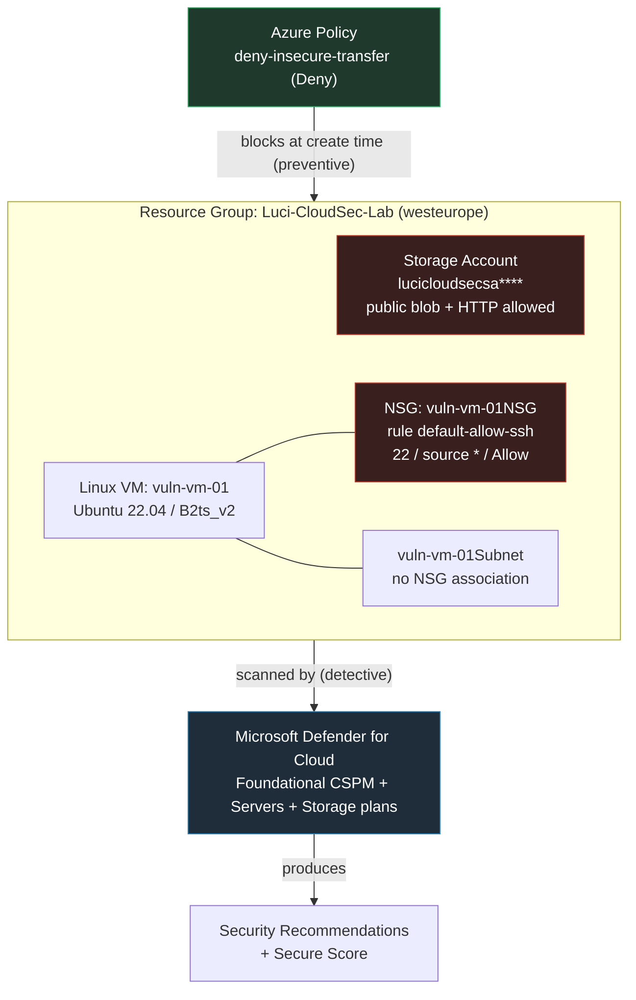

# Azure Cloud Security Posture Lab — Defender for Cloud, RBAC & Azure Policy

> A hands-on lab that intentionally builds an insecure Azure environment, lets **Microsoft Defender for Cloud** detect the misconfigurations (detective control), and then enforces a **deny-by-default Azure Policy** so the same insecure resources can never be created again (preventive control). Closes the loop with remediation evidence.

**Author:** Yusuf Efil (Luci) — SOC L2 Analyst & Detection Engineer
**Companion project:** [Detection-as-Code with Microsoft Sentinel](https://github.com/yusufefil/detection-engineering-portfolio)
**Region:** `westeurope` · **Resource group:** `Luci-CloudSec-Lab`

---

## 1. Why this lab

Most SOC experience is *detective* — you watch alerts after something happens. Cloud security demands a second mindset: *preventive* — stop the insecure thing from existing in the first place. This lab demonstrates both, side by side, on the same set of intentionally vulnerable resources:

- **Defender for Cloud (CSPM)** scans the environment and reports misconfigurations *after* deployment → detective.
- **Azure Policy (`Deny`)** blocks non-compliant resources *at creation time* → preventive.

The exercise mirrors how a detection engineer thinks: build the "attacker-friendly" condition, confirm the platform flags it, map it to MITRE ATT&CK, then close it and prove it's closed.

---

## 2. Architecture



---

## 3. Lab phases

| Phase | Goal | Outcome |
|------:|------|---------|
| 1 | Clean resource group | `Luci-CloudSec-Lab` created |
| 2 | Build insecure environment | Public storage + internet-facing SSH VM |
| 3 | Enable Defender for Cloud, run scan | 7 recommendations, CSV export |
| 4 | Remediate misconfigurations | Before/after evidence |
| 5 | Enforce Azure Policy (`Deny`) | Insecure storage creation blocked |
| 6 | Document & clean up | This report + resource teardown |

> Phases 4 and 5 are presented in logical order (detect → remediate → prevent). In execution, Policy was applied while waiting for the CSPM scan to mature, since Policy enforcement is immediate and scan-independent.

---

## 4. Phase 1 — Clean resource group

```powershell
az group create -n Luci-CloudSec-Lab -l westeurope
```

A resource group is a logical container; creating one is free. Costs begin only when billable resources are placed inside.

---

## 5. Phase 2 — Building the insecure environment

### 5.1 Insecure storage account

Four deliberate weaknesses, each a classic data-leak / interception vector:

```powershell
az storage account create -n lucicloudsecsa**** -g Luci-CloudSec-Lab -l westeurope `
  --sku Standard_LRS --kind StorageV2 `
  --allow-blob-public-access true `   # public read of blobs
  --min-tls-version TLS1_0 `          # legacy/broken TLS (see note)
  --https-only false                  # cleartext HTTP permitted
```

**Verification:**

```text
Name                  PublicBlob    Tls     HttpsOnly
--------------------  ------------  ------  -----------
lucicloudsecsa****    True          TLS1_2  False
```

> **Platform-baseline observation:** the request set `--min-tls-version TLS1_0`, but Azure Storage **silently forced TLS 1.2**. Azure deprecated TLS 1.0/1.1 for Storage in late 2024, so the platform enforces a minimum baseline regardless of the requested value. This is a live example of the same baseline-enforcement principle this lab explores at the Policy layer — one weakness was removed by the platform itself, leaving three intentional misconfigurations.

`publicNetworkAccess` returned `null`, which Azure treats as the (insecure) default of **enabled** — public network access remained open.

### 5.2 Internet-facing VM with open management port

The cloud's #1 attack vector: an internet-reachable management port (SSH/22 on Linux, RDP/3389 on Windows). `az vm create` opens SSH to the world *by default* on Linux — building the insecure state requires no extra effort.

```powershell
az vm create -n vuln-vm-01 -g Luci-CloudSec-Lab -l westeurope `
  --image Ubuntu2204 --size Standard_B2ts_v2 `
  --admin-username azureadmin `
  --authentication-type password `    # password auth instead of SSH keys
  --admin-password '<strong-password>' `
  --nsg-rule SSH `                     # opens port 22 to source *
  --public-ip-sku Standard
```

**Capacity note:** `Standard_B1s` failed in `westeurope` with `SkuNotAvailable` (regional capacity restriction). `az vm list-skus -l westeurope --size Standard_B` surfaced available alternatives; `Standard_B2ts_v2` (cheapest available burstable, 2 vCPU) was used.

**NSG rule confirms the exposure:**

```text
Name               Port    Source    Access
-----------------  ------  --------  --------
default-allow-ssh  22      *         Allow
```

`source = *` means SSH is reachable from any IP on the internet — exactly the evidence Defender flags.

---

## 6. Phase 3 — Defender for Cloud (detective control)

Defender for Cloud operates in two tiers:

- **Foundational CSPM** — free, on by default. Scans against the Microsoft Cloud Security Benchmark, produces a secure score and **recommendations**. This alone catches the lab's misconfigurations.
- **Defender plans** (Servers, Storage, …) — paid, add active **threat detection / alerting**. Enabled here to accelerate assessment and unlock the alerting dimension.

```powershell
az provider register --namespace Microsoft.Security
az security pricing create -n VirtualMachines  --tier Standard
az security pricing create -n StorageAccounts  --tier Standard
```

```text
Plan             Tier
---------------  --------
VirtualMachines  Standard
StorageAccounts  Standard
```

### 6.1 Findings

The first scan produced **7 recommendations**. The five belonging to this lab (`Luci-CloudSec-Lab`) — the other two were resources from the companion Sentinel lab in the same subscription and are out of scope:

| # | Recommendation | Resource | Severity |
|--:|----------------|----------|:--------:|
| 1 | All network ports should be restricted on NSGs | `vuln-vm-01` | **High** |
| 2 | Management ports should be protected with JIT access | `vuln-vm-01` | **High** |
| 3 | Management ports should be closed | `vuln-vm-01` | Medium |
| 4 | Machines should have a vulnerability assessment solution | `vuln-vm-01` | Medium |
| 5 | Subnets should be associated with an NSG | `vuln-vm-01Subnet` | Low |

> The portal initially showed risk level as *"Not evaluated"* (risk scoring lags behind recommendation generation). The exported CSV already carried correct **severity** values — a reminder to treat the machine-readable export, not just the UI, as ground truth. The full export is included as a deliverable.

### 6.2 MITRE ATT&CK mapping

Misconfigurations are pre-conditions, not techniques — but each one enables specific adversary behaviour. Mapping only where the link is direct (rather than forcing IDs):

| Misconfiguration | Enables | ATT&CK |
|------------------|---------|--------|
| SSH/22 open to `*` | Exposed remote-management service; brute-force surface | [T1133 External Remote Services](https://attack.mitre.org/techniques/T1133/), [T1110 Brute Force](https://attack.mitre.org/techniques/T1110/) |
| Password auth (no SSH keys) | Credential guessing / spraying | [T1110.001 / T1110.003](https://attack.mitre.org/techniques/T1110/) |
| Public blob access | Reading data from misconfigured cloud storage | [T1530 Data from Cloud Storage](https://attack.mitre.org/techniques/T1530/) |
| HTTPS-only disabled | Cleartext traffic interception / downgrade | [T1040 Network Sniffing](https://attack.mitre.org/techniques/T1040/), [T1557 Adversary-in-the-Middle](https://attack.mitre.org/techniques/T1557/) |
| Subnet without NSG | Defence-in-depth / segmentation gap (enables lateral reach) | Hardening gap — no single technique |
| No vulnerability assessment | Visibility gap (not an adversary action) | Detection gap |

---

## 7. Phase 4 — Remediation (before / after)

```powershell
# 1. Restrict SSH: source *  ->  only my public IP
az network nsg rule update -g Luci-CloudSec-Lab --nsg-name vuln-vm-01NSG `
  -n default-allow-ssh --source-address-prefixes "<your-ip>/32"

# 2. Harden storage: disable public blob access + force HTTPS
az storage account update -n lucicloudsecsa**** -g Luci-CloudSec-Lab `
  --allow-blob-public-access false --https-only true
```

| Setting | Before (Phase 2) | After (Phase 4) |
|---------|:----------------:|:---------------:|
| Storage — public blob access | `True` | **`False`** |
| Storage — HTTPS-only | `False` | **`True`** |
| NSG — SSH source | `*` (any host) | **`<your-ip>/32`** |

```text
Name                  PublicBlob    HttpsOnly
--------------------  ------------  -----------
lucicloudsecsa****    False         True
```

> Defender re-evaluates posture on a periodic cycle, so recommendations move from *Unhealthy* to *Healthy* on the next scan (hours), not instantly. The CLI output above is the immediate proof of remediation; the secure-score improvement follows on the next assessment.

---

## 8. Phase 5 — Azure Policy (preventive control)

Azure Policy enforces rules **at creation time**. Three parts: a **definition** (the rule), an **assignment** (scope it to a subscription/RG), and an **effect** (`Audit` = flag, `Deny` = block, `DeployIfNotExists` = auto-fix).

```powershell
# Use the built-in "Secure transfer to storage accounts should be enabled" definition
$pol = az policy definition list `
  --query "[?displayName=='Secure transfer to storage accounts should be enabled'].name | [0]" -o tsv

# Override its effect to Deny via a params file (PS 5.1 mangles inline JSON quoting)
'{ "effect": { "value": "Deny" } }' | Out-File deny-params.json -Encoding ascii

az policy assignment create --name "deny-insecure-transfer" `
  --display-name "Deny storage without secure transfer" `
  --policy $pol --params "@deny-params.json" `
  --resource-group Luci-CloudSec-Lab
```

### 8.1 Proof — the policy blocks an insecure resource

Attempting to create a storage account with `--https-only false`:

```text
(RequestDisallowedByPolicy) Resource 'lucipolicytest****' was disallowed by policy.
  policyAssignment: Deny storage without secure transfer
  policyDefinition: Secure transfer to storage accounts should be enabled
```

The most instructive part is the policy engine's decision trace:

```json
"evaluatedExpressions": [
  { "expression": "type",
    "expressionValue": "Microsoft.Storage/storageAccounts",
    "operator": "Equals", "result": "True" },
  { "expression": "Microsoft.Storage/.../supportsHttpsTrafficOnly",
    "expressionValue": false, "targetValue": "false",
    "operator": "Equals", "result": "True" }
]
```

Both conditions evaluated `True` (it *is* a storage account **and** secure transfer *is* disabled) → effect `Deny` → the resource was **never created**.

### 8.2 Detective vs preventive — the core contrast

| | Microsoft Defender for Cloud | Azure Policy (`Deny`) |
|---|---|---|
| Control type | **Detective** | **Preventive** |
| Timing | *After* the resource exists | *At creation time* |
| Outcome | Recommendation + lowered secure score | Resource creation blocked |
| Analogy | Inspector reports the open door | Door is never installed open |

The same policy that **blocked** the insecure storage in Phase 5 **allowed** the hardened storage in Phase 4 (`--https-only true`) — it discriminates on compliance, not on the operation.

---

## 9. Phase 6 — Cleanup & cost

```powershell
# Remove the policy assignment
az policy assignment delete --name "deny-insecure-transfer" --resource-group Luci-CloudSec-Lab

# (Optional, hygiene) revert subscription-scoped Defender plans to Free so other
# resources in the subscription stop incurring Defender charges
az security pricing create -n VirtualMachines  --tier Free
az security pricing create -n StorageAccounts  --tier Free

# Delete the entire resource group (VM, disk, NIC, public IP, NSG, vNet, storage)
az group delete -n Luci-CloudSec-Lab --yes --no-wait
```

**Cost discipline:**
- Resource group and empty storage are effectively free.
- `Standard_B2ts_v2` ≈ $0.01–0.02/hr; Standard public IP ≈ $0.005/hr — a few cents over the lab's lifetime.
- An internet-facing VM with an open management port attracts automated brute-force within minutes — **always delete (or `deallocate`) it promptly**. `stop` alone still bills the disk.

---

## 10. Skills demonstrated

- **Cloud security posture management** — Defender for Cloud setup, recommendation triage, secure score, CSV evidence export.
- **Preventive guardrails** — Azure Policy definitions/assignments, `Deny` effect, reading the policy evaluation trace.
- **Defence-in-depth reasoning** — detective vs preventive controls applied to the same resources.
- **Threat-informed defence** — mapping misconfigurations to MITRE ATT&CK techniques.
- **Remediation with evidence** — measurable before/after hardening.
- **Azure CLI fluency** — resource provisioning, troubleshooting regional SKU capacity, scoped RBAC concepts (least privilege).
- **Security hygiene** — sensitive identifiers (subscription ID, personal IP) redacted from public artifacts.

---

## Deliverables

- `azure-cloudsec-lab.md` — this report.
- `MicrosoftDefenderForCloudRecommendations_*.csv` — raw Defender recommendation export.
- *Screenshots:* Defender Overview, Recommendations list, Policy `RequestDisallowedByPolicy` block, remediation before/after.

---

### Screenshot placeholders

> Drop the captured PNGs into an `images/` folder and reference them here.

```markdown


```
